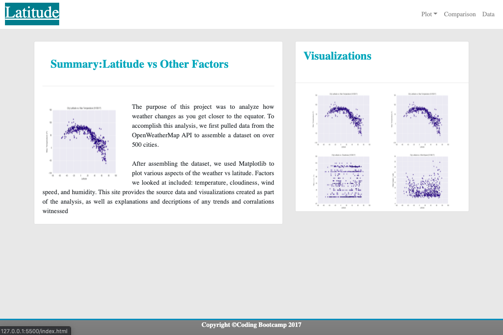
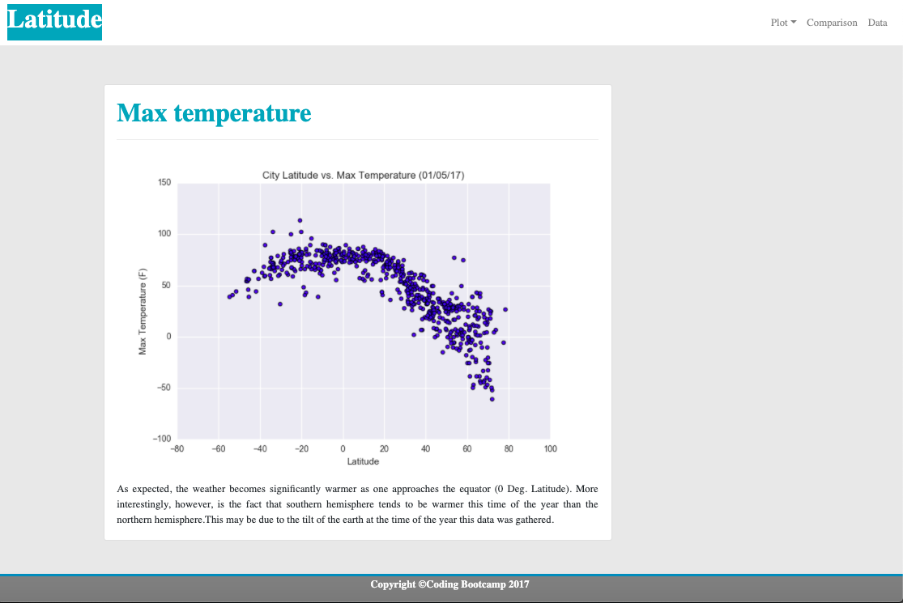
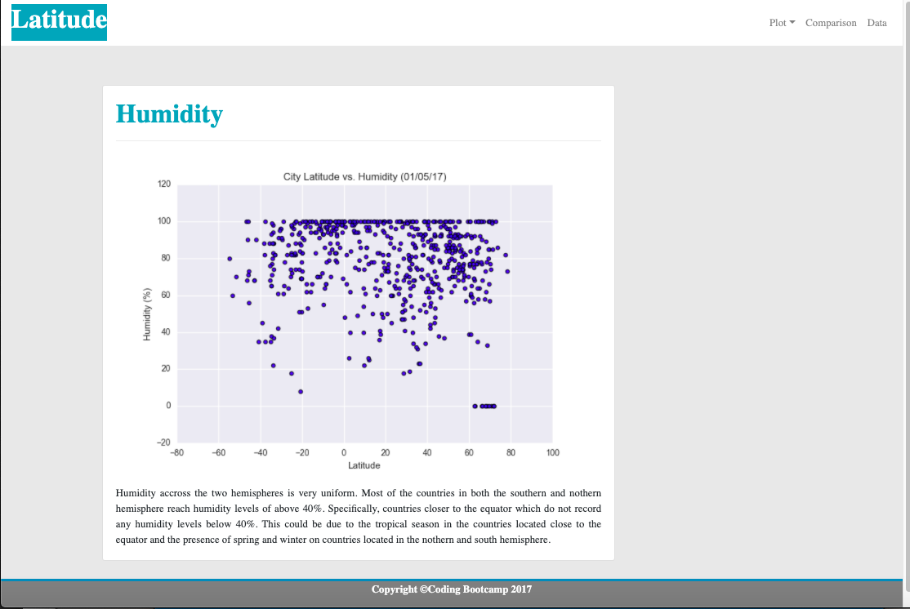
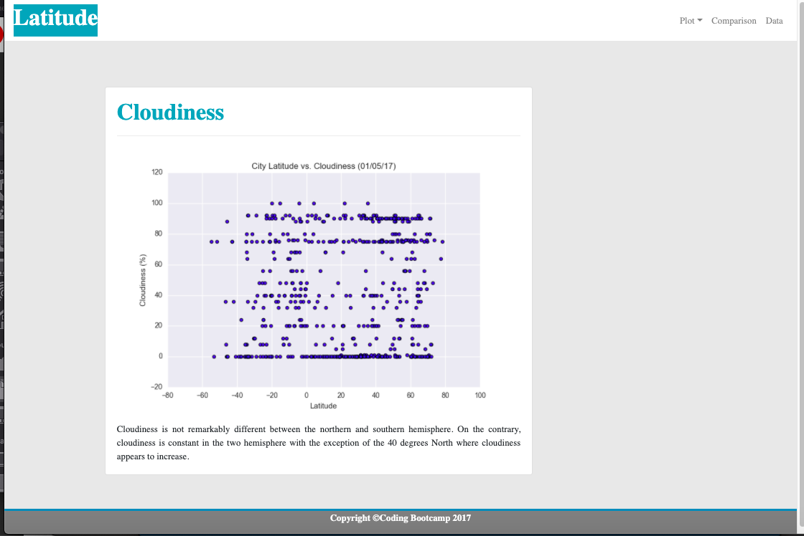
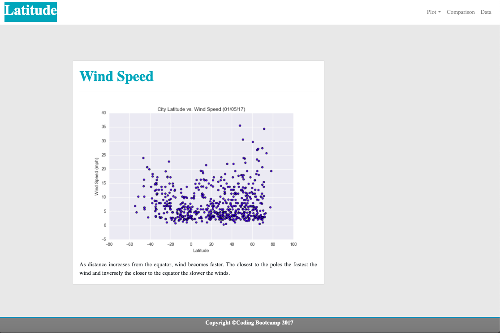
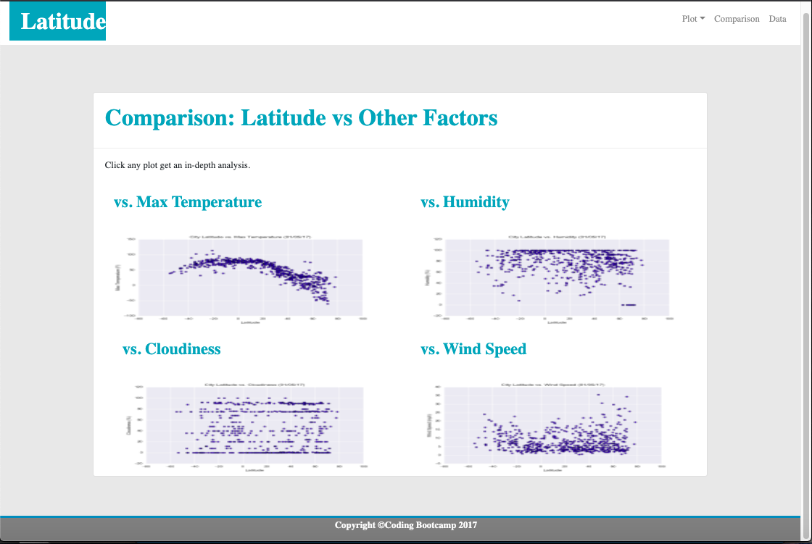
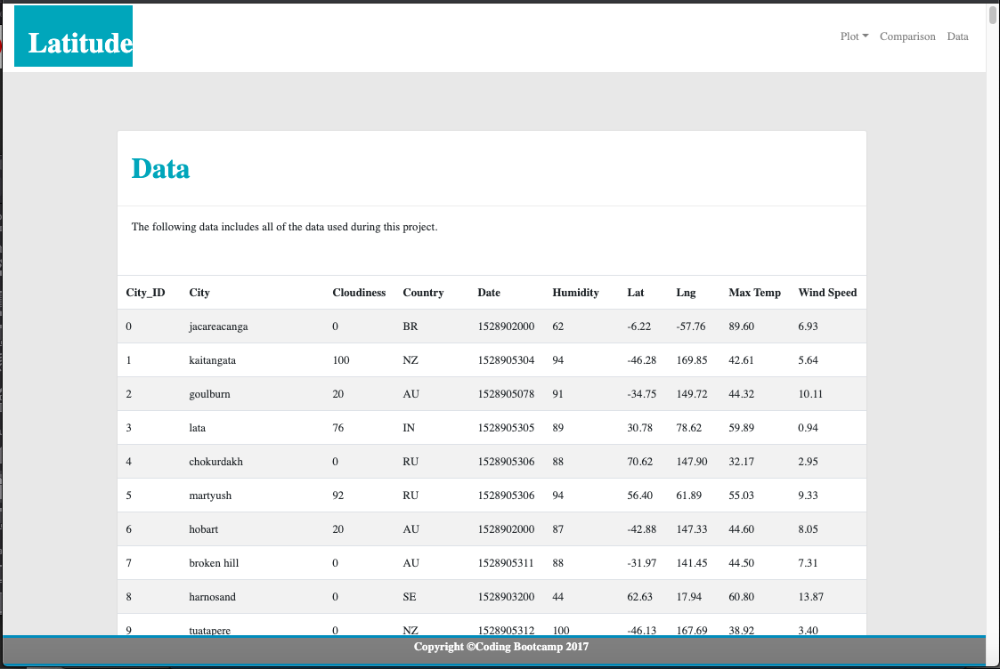

#  Web Visualization Dashboard (Latitude)

## Description

Created a visualization dashboard website  with individual pages to analyze how weather changes as you get closer to the equator by pulling data from the OpenWeatherMap API to assemble a dataset on over 500 cities(Refer to Python API Repo https://github.com/Elisu87/Python-API-Challenge/blob/master/README.md). Factors looked included: temperature, cloudiness, wind speed, and humidity.

## Technologies
- html
- CSS
- Bootstrap 
- Pandas

## The website consists of 7 pages total, including:

### A landing page containing:
An explanation of the project.
Links to each visualizations page.

### Four visualization pages, each with:

A descriptive title and heading tag.
The plot/visualization itself for the selected comparison.
A paragraph describing the plot and its significance.

### A "Comparisons" page that:

Contains all of the visualizations on the same page.

### A "Data" page that:

Displays a responsive table containing the data used in the visualizations.

The data must come from converting it to HTML.pandas.

